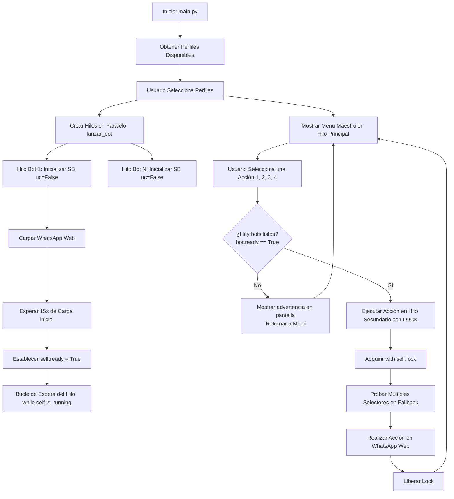

# Flujo Paso a Paso de la Automatización Hilo-Segura

Este documento describe la secuencia técnica detallada y sincronizada que sigue el bot para automatizar WhatsApp Web de manera paralela y segura.

---

## Diagrama de Flujo General

---

## 1. Inicialización y Autenticación
1. Se levanta la instancia de `SeleniumBase` (SB) utilizando `uc=False` (Chrome estándar para evitar bloqueos) y asociando el parámetro `user_data_dir` con la ruta correspondiente (ej. `perfiles/chrome/Profile 1`).
2. Al apuntar a esta carpeta, el bot recupera la sesión almacenada. Si es la primera vez, el usuario deberá escanear el código QR. Si ya ha sido escaneado, pasará directamente a los chats.
3. El bot carga `https://web.whatsapp.com/` y hace un `time.sleep` inicial de 15 segundos para asegurar que el DOM de WhatsApp termine de renderizarse.
4. **Liberación del Semáforo**: Una vez completado este retraso, el bot establece `self.ready = True` e imprime `LISTO PARA COMANDOS`.

## 2. Menú Interactivo de Pruebas y Control de Concurrencia
1. Una vez cargada la interfaz principal de WhatsApp, se muestra el menú interactivo en el hilo de consola principal.
2. Si el usuario intenta ejecutar un comando antes de que un bot esté inicializado, el menú detecta que `bot.ready` es `False`, muestra una advertencia amistosa en consola, y retorna al menú.
3. Al invocar un comando sobre un bot listo, se adquiere un **Bloqueo Mutuo (`self.lock`)** que serializa cualquier acceso al driver de dicho bot, impidiendo colisiones entre comandos paralelos.

## 3. Flujo de Acciones Disponibles con Sistema de Fallbacks

### Acción: Entrar a la pestaña Grupos
1. El bot adquiere el Lock del driver.
2. Se itera sobre una lista de **5 XPath alternativos** para localizar el filtro o botón de "Grupos" (manejando variantes de etiquetas `span`, botones, atributos `@title` y coincidencias parciales).
3. Una vez encontrado el elemento correcto, se hace *Scroll* (`scrollIntoView`) y se realiza el clic (ya sea de manera nativa o inyectando un script JS como alternativa).
4. El Lock se libera.

### Acción: Imprimir títulos de los grupos
1. Se asume que el usuario ya se encuentra en la vista filtrada por grupos.
2. Se adquiere el Lock del driver.
3. Mediante la consulta XPath que busca spans de títulos (`@dir="auto" and @title` con clase `x1iyjqo2`), se recuperan todos los elementos visualizados en pantalla.
4. Se itera la lista extrayendo el atributo `title` de cada elemento y se imprimen en consola anteponiendo el nombre del perfil del bot.
5. El Lock se libera.

### Acción: Entrar a un chat de grupo
1. Se le pide al usuario que digite el título del grupo (o una parte de él).
2. Se adquiere el Lock del driver.
3. Se formatea el string XPath para buscar la fila (`role="row"`) que contenga el título ingresado.
4. Si no se visualiza en pantalla, el bot realiza scrolls sucesivos de 600px en el contenedor lateral `#pane-side` hasta dar con el elemento o alcanzar el fin de la lista (30 reintentos máximos).
5. Una vez localizado, se intentan **4 estrategias secuenciales de clic** (SeleniumBase click, click nativo, despacho de eventos MouseDown/MouseUp/Click por JS, y click nativo por JS) hasta detectar que el panel de chat se ha abierto.
6. El Lock se libera.

### Acción: Enviar mensaje a un chat abierto
1. Se adquiere el Lock del driver.
2. **Escritura del Mensaje (Caja de Texto)**: Se busca la caja de texto iterando sobre **4 XPath estables** (incluyendo selectores de testid, roles de textbox y filtros HSL class).
3. Al dar con ella, se hace clic, se le otorga el foco, y se inserta el texto simulación de teclado.
4. **Envío del Mensaje**: Se localiza el botón de enviar iterando sobre **5 XPath alternativos** (manejando variaciones de iconos y clases).
5. **Acción de Respaldo**: Si no se ubica el botón físico de enviar, el bot simula presionar la tecla física **`ENTER`** directamente sobre la caja de texto para completar el envío.
6. El Lock se libera.

