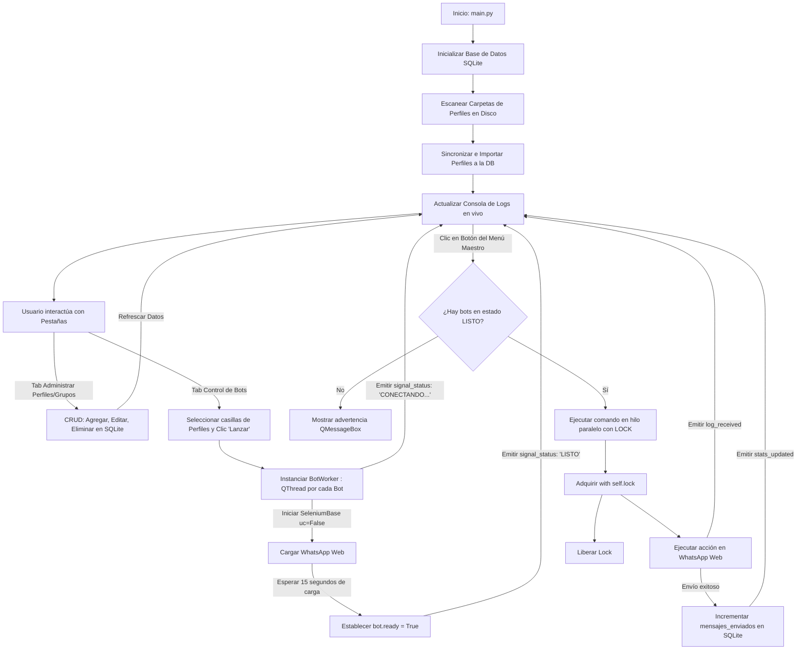

# Flujo Paso a Paso de la Automatización con Interfaz Gráfica (PyQt5)

Este documento describe el flujo de control, la secuencia técnica y el ciclo de vida de los datos al utilizar la nueva **Interfaz Gráfica de Escritorio (PyQt5)** conectada a la base de datos **SQLite**.

---

## 📊 Diagrama de Flujo del Sistema Gráfico

---

## 1. Inicialización y Sincronización de Datos (Arranque)
1. **Inicialización de SQLite**: La aplicación invoca `db_manager.inicializar_base_de_datos()` para garantizar la existencia de las tablas `perfiles`, `grupos` y `perfil_grupo` (Many-to-Many).
2. **Escaneo de Disco**: Mediante `carpeta_gestor.py`, la aplicación escanea la estructura física de la carpeta `perfiles/`.
3. **Importación Automática**: El sistema registra en SQLite cualquier perfil físico encontrado que no estuviera registrado, asignándole valores predeterminados para uso inmediato.
4. **Carga de UI**: Se renderiza la ventana principal de PyQt5 con la hoja de estilos Dark Mode premium y se pueblan todas las tablas.

---

## 2. Gestión CRUD desde la Interfaz Gráfica
* **Administración de Perfiles (CRUD)**:
  - Al hacer clic en **Agregar Perfil** o **Editar Perfil Seleccionado**, se despliega un formulario modal (`QDialog`).
  - Al guardar, los cambios impactan directamente la tabla `perfiles` de SQLite y la UI se actualiza al instante.
  - Al hacer clic en **Eliminar Perfil**, se solicita confirmación gráfica antes de borrar permanentemente el registro de la DB.
* **Administración de Grupos (CRUD)**:
  - Permite añadir o eliminar los nombres oficiales de los grupos destino en la base de datos de manera sumamente intuitiva.
* **Vincular Perfiles con Grupos (Asociaciones Muchos a Muchos)**:
  - En la pestaña de estadísticas, el usuario selecciona un perfil y un grupo mediante desplegables (`QComboBox`) y hace clic en **Crear Asociación**. Esto inserta la relación en la tabla intermedia `perfil_grupo` con un contador de mensajes inicializado en `0`.

---

## 3. Lanzamiento Asíncrono de Bots (Sin Bloqueo de UI)
1. En la pestaña **Control de Bots**, el usuario marca las casillas de verificación de los perfiles que desea abrir y pulsa **Lanzar Seleccionados**.
2. Por cada perfil, se crea e inicia una instancia de **`BotWorker` (`QThread`)**.
3. El hilo secundario cambia su estado visual a `CONECTANDO...` y levanta `SeleniumBase` de manera aislada con `uc=False` para máxima estabilidad.
4. Toda la actividad de inicialización del navegador se reporta en tiempo real a través de la señal `log_received` directamente en la **Consola de Logs** del panel principal.
5. Durante todo el proceso de carga de Chrome, **la interfaz gráfica permanece 100% fluida y operativa** (se puede mover la ventana, cambiar de pestaña o editar registros sin congelamientos).
6. Una vez que WhatsApp Web se carga completamente (transcurridos los 15 segundos iniciales), el bot activa `ready = True` y el hilo emite la señal `status_changed` para pintar la celda del bot de color **VERDE** con el estado **`LISTO`**.

---

## 4. Ejecución del Menú Maestro Gráfico y Estadísticas en Vivo
Cuando el usuario pulsa un botón de acción en el **Menú Maestro**:
1. Se filtra la lista y se seleccionan únicamente aquellos hilos que reporten el estado `LISTO`.
2. Se disparan los comandos en hilos independientes para cada navegador de forma secuencial y segura utilizando el semáforo `self.lock`.
3. Al completar con éxito el envío de un mensaje:
   - El bot incrementa el contador de mensajes del perfil y el grupo en SQLite.
   - El bot emite la señal `stats_updated`.
   - El hilo principal de la GUI captura la señal y **recarga instantáneamente la tabla de estadísticas Many-to-Many en vivo**, mostrando el incremento de los mensajes enviados en tiempo real.
