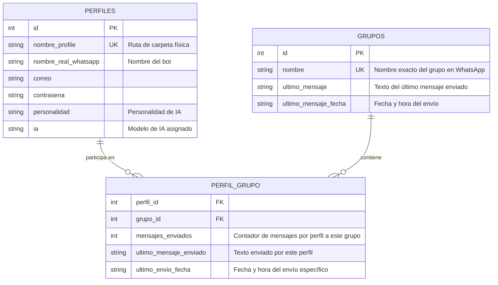

# 🤖 WhatsApp Multi-Perfil - Panel de Control & Estadísticas 🤖

Esta es la versión del bot controlada enteramente por consola, ahora potenciada con un **Panel de Control (CLI Dashboard) interactivo, una Base de Datos relacional en SQLite y un sistema automático de seguimiento de estadísticas**.

El sistema implementa una **lógica multi-perfil sincronizada, asíncrona e hilo-segura**, permitiendo ejecutar múltiples perfiles de navegador en paralelo de forma robusta e independiente.

---

## 📂 Estructura de Archivos del Proyecto

```text
/sin-ui
├── main.py                  # Punto de entrada principal (redirige al Dashboard)
├── carpeta_gestor.py        # Escaneo y detección de perfiles locales físicos
├── bot_sb.py                # Instancias de SeleniumBase, automatización e hilo-seguridad
├── ui_selectors.py          # Centralización de XPaths estables de WhatsApp Web
│
├── base_de_datos/           # [NUEVO] Capa de Persistencia SQLite
│   ├── db_manager.py        # Inicializador de tablas, consultas relacionales y estadísticas
│   └── whatsapp_bot.db      # Archivo de base de datos SQLite
│
├── Ui/                      # [NUEVO] Capa de Interfaz de Usuario
│   └── dashboard.py         # Tablas visuales double-border, formularios y menú maestro
│
├── arquitectura.md          # Documentación detallada del modelo Maestro-Esclavo y Hilos
├── FLUJO.md                 # Flujo paso a paso, selectores y diagramas Mermaid
└── README.md                # Esta guía en español
```

---

## 🗃 Estructura de la Base de Datos (SQLite)

Para soportar múltiples perfiles asociados a múltiples grupos, el sistema implementa una base de datos relacional con una relación **Muchos a Muchos (Many-to-Many)** y recolección de estadísticas integradas:



### 1. Sincronización Automática
Al iniciar la aplicación por primera vez, el sistema detecta de forma autónoma los perfiles físicos en el disco (`perfiles/chrome/...` y `perfiles/firefox/...`) y los **registra en la Base de Datos automáticamente** con configuraciones predeterminadas para que puedas utilizarlos de inmediato sin configuraciones manuales.

---

## 📊 Sistema de Seguimiento de Estadísticas

Cada vez que un bot automatiza con éxito el envío de un mensaje en WhatsApp Web (ya sea por clic en el botón enviar o presionando la tecla de respaldo `ENTER`):
1. El bot de SeleniumBase invoca a la base de datos de manera hilo-segura.
2. Incrementa el contador de `mensajes_enviados` específico de la dupla **Perfil-Grupo**.
3. Registra el texto exacto enviado (`ultimo_mensaje_enviado`) y la marca de tiempo de envío (`ultimo_envio_fecha`).
4. Actualiza globalmente la tabla de `grupos` con la información general de la última actividad del bot en dicho grupo.

---

## 🖥 Panel de Control Interactivo (CLI Dashboard)

Al ejecutar `python main.py`, accederás a una interfaz visual de consola diseñada con colores ANSI y tablas ASCII premium de borde doble:

### Opciones Disponibles:
1. **Administrar Perfiles**: Permite registrar nuevos perfiles físicos en la base de datos o definir configuraciones.
2. **Administrar Grupos**: Permite registrar nombres oficiales de grupos de WhatsApp de destino.
3. **Asociar Perfil con Grupo**: Vincula un perfil con un grupo específico (Relación Muchos a Muchos) para la mensajería dirigida.
4. **Editar Datos/Personalidad**: Edita en caliente el correo, contraseña, personalidad de la IA o el motor del perfil.
5. **Ver Reporte de Estadísticas Globales**: Muestra una tabla completa e interactiva con el total de mensajes automatizados, clasificados por perfil, grupo, contenido y fecha.
6. **Iniciar Bots y Automatización**: Despliega la pasarela de lanzamiento paralelo donde seleccionas qué perfiles cargar y accedes al **Menú Maestro de Control en Vivo** para ordenar navegación por grupos, obtención de títulos o envío de mensajes individuales/masivos.

---

## 🚀 Ejecución y Requisitos

1. Asegúrate de tener instaladas las dependencias del sistema:
   ```bash
   pip install seleniumbase
   ```
2. Para iniciar el Dashboard interactivo completo, ejecuta:
   ```bash
   python main.py
   ```
