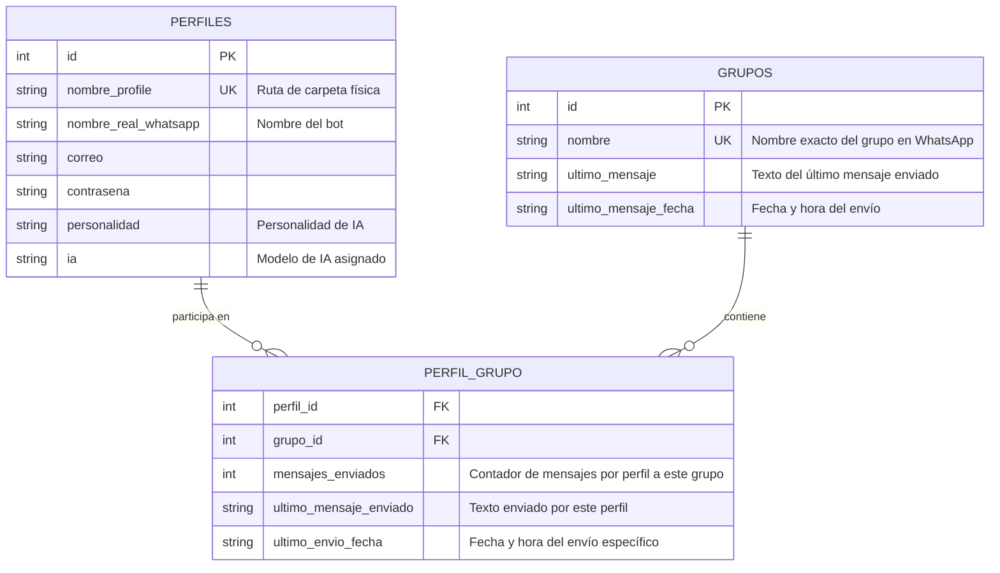

# 🤖 WhatsApp Multi-Perfil - Panel de Control & Estadísticas Premium (PyQt5) 🤖

Esta es la versión del bot controlada a través de una **Interfaz Gráfica de Escritorio (PyQt5) Premium**, potenciada con una **Base de Datos relacional en SQLite, administración CRUD integrada y un sistema en vivo de seguimiento de estadísticas**.

La aplicación cuenta con un diseño estético de alta gama en **Dark Mode** (estilo Spotify/Discord) y una **arquitectura no bloqueante basada en hilos de Qt (QThread) y Señales de comunicación**, lo cual permite arrancar y operar múltiples navegadores en paralelo de forma completamente fluida y sin congelamientos de pantalla.

---

## 📂 Estructura de Archivos del Proyecto

```text
/sin-ui
├── main.py                  # Punto de entrada principal (ejecuta la GUI por defecto)
├── carpeta_gestor.py        # Escaneo y detección de perfiles locales físicos
├── bot_sb.py                # Instancias de SeleniumBase, automatización y señales de logs
├── ui_selectors.py          # Centralización de XPaths estables de WhatsApp Web
│
├── base_de_datos/           # Capa de Persistencia SQLite
│   ├── db_manager.py        # Inicializador de tablas, consultas Many-to-Many y estadísticas
│   └── whatsapp_bot.db      # Archivo persistente de base de datos SQLite
│
├── Ui/                      # Capa de Interfaces de Usuario
│   ├── gui_app.py           # [NUEVO] Aplicación de escritorio PyQt5, QThreads, QSS y CRUDs
│   └── dashboard.py         # Versión alternativa del Panel en Consola (CLI Dashboard)
│
├── arquitectura.md          # Arquitectura detallada de hilos (QThread y Señales de PyQt5)
├── FLUJO.md                 # Flujo técnico de automatización, selectores y diagramas Mermaid
└── README.md                # Esta guía en español
```

---

## 🗃️ Estructura de la Base de Datos (SQLite)

Para soportar múltiples perfiles asociados a múltiples grupos, el sistema implementa una base de datos relacional con una relación **Muchos a Muchos (Many-to-Many)** y estadísticas automatizadas en vivo:



### 1. Sincronización Automática al Arrancar
Al iniciar la aplicación por primera vez, el sistema detecta de forma autónoma los perfiles físicos en el disco (`perfiles/chrome/...` y `perfiles/firefox/...`) y los **registra en la Base de Datos automáticamente** con configuraciones estándar para que puedas utilizarlos de inmediato sin configuraciones manuales.

---

## 📊 Sistema de Seguimiento de Estadísticas en Vivo

Cada vez que un bot de SeleniumBase automatiza con éxito el envío de un mensaje en WhatsApp Web:
1. Incrementa el contador de `mensajes_enviados` específico de la dupla **Perfil-Grupo** en SQLite de forma hilo-segura.
2. Registra el texto exacto enviado (`ultimo_mensaje_enviado`) y la marca de tiempo de envío (`ultimo_envio_fecha`).
3. El hilo secundario emite la señal `stats_updated`.
4. **Actualización en Caliente**: La ventana principal de PyQt5 recibe la señal y **refresca al instante la tabla de estadísticas visual**, incrementando el contador en pantalla en tiempo real sin interferir con la navegación del bot.

---

## 🖥️ Características de la Interfaz Gráfica (PyQt5)

La ventana principal se organiza en 4 pestañas interactivas:

1. **Control de Bots**:
   - **Tabla de Estado**: Muestra los perfiles disponibles y su estado en vivo (`APAGADO`, `CONECTANDO...`, `LISTO`, `ERROR`).
   - **Casillas de Verificación**: Selecciona qué perfiles abrir en paralelo.
   - **Menú Maestro de Comandos**: Botones para enviar comandos en caliente a todos los bots listos (entrar a pestaña grupos, imprimir títulos, envío personalizado a grupos vinculados, o envío masivo común).
   - **Terminal de Logs**: Consola integrada oscura que muestra la actividad detallada del driver paso a paso.
2. **Administrar Perfiles (CRUD)**:
   - Registro, edición y eliminación de perfiles mediante diálogos modales gráficos.
3. **Administrar Grupos (CRUD)**:
   - Registro y eliminación de los grupos destino oficiales de WhatsApp Web.
4. **Asociaciones & Estadísticas**:
   - **Vinculador**: Asocia un perfil con un grupo de forma gráfica mediante menús desplegables (`QComboBox`).
   - **Tabla de Estadísticas**: Reporte en tiempo real de los mensajes enviados e historial detallado.

---

## 🚀 Requisitos y Ejecución

### 1. Requisitos de Dependencias:
Asegúrate de tener instaladas las dependencias del sistema:
```bash
pip install seleniumbase pyqt5
```

### 2. Ejecutar la Aplicación Gráfica (Predeterminada):
Para iniciar la interfaz gráfica premium con PyQt5, simplemente ejecuta:
```bash
python main.py
```

### 3. Ejecutar la Versión de Consola Alternativa (CLI):
Si por alguna razón prefieres utilizar la versión original en terminal con el CLI Dashboard, puedes ejecutar directamente:
```bash
python Ui/dashboard.py
```
