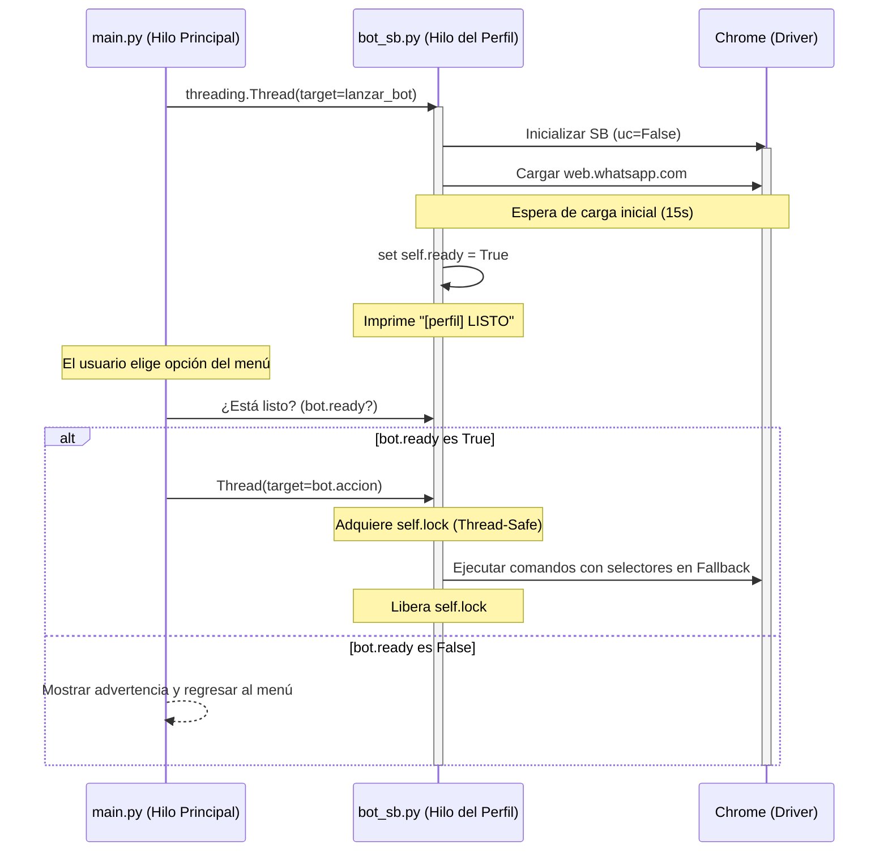

# Arquitectura Multi-Perfil en Consola (sin-ui)

Este documento detalla la arquitectura de la versión "sin-ui" (solo consola), la cual ha sido refactorizada para permitir la **ejecución asíncrona, paralela, segura y altamente estable de múltiples perfiles de navegador** al mismo tiempo.

---

## Patrón Maestro-Esclavo (Master-Slave) con Sincronización

Debido a que la consola de comandos no puede manejar múltiples procesos solicitando entrada de texto (`input()`) al mismo tiempo sin colisionar, el sistema utiliza un modelo de **Menú Maestro centralizado** en el hilo principal y **múltiples instancias esclavas autónomas** ejecutadas en hilos independientes.

Para evitar errores de concurrencia y caídas en el driver de Chrome (como `ConnectionRefusedError`), la arquitectura implementa tres pilares de sincronización:

### Componentes y Pilares de Diseño

1. **`main.py` (Hilo Principal / Menú Maestro)**
   - **Gestión de Perfiles**: Utiliza `carpeta_gestor.py` para detectar los perfiles locales existentes.
   - **Lanzamiento Paralelo**: Crea un Hilo (`threading.Thread`) persistente para cada bot seleccionado por el usuario.
   - **Consola Exclusiva**: Centraliza toda interacción de teclado (`input()`) para evitar colisiones y bloqueos de terminal.
   - **Salvaguarda de Inicialización (Ready Check)**: Antes de enviar comandos a los bots (opciones 1, 2, 3, 4), el menú filtra las instancias activas y solo ejecuta la instrucción en aquellos bots que han completado su carga (`bot.ready == True`). Si ningún perfil está listo, muestra una advertencia en lugar de intentar llamar a un driver no inicializado.

2. **`bot_sb.py` (Instancias Esclavas Hilo-Seguras)**
   - **Clase `WhatsappBot`**: Se ejecuta de manera asíncrona.
   - **Driver Estable (`uc=False`)**: Inicializa SeleniumBase con `uc=False` (Chrome estándar) para garantizar la máxima estabilidad con perfiles locales en Windows, evitando bloqueos de puerto y caídas por detección de conflictos.
   - **Estado `ready` (Semáforo de Carga)**: Inicializado en `False`. Se establece en `True` solo después de que WhatsApp Web carga por completo en el navegador (15 segundos de espera inicial).
   - **Bloqueo Mutuo (`self.lock = threading.Lock()`)**: Todas las acciones interactivas (`entrar_a_grupos`, `entrar_a_chat`, `escribir_y_enviar_mensaje`, etc.) se ejecutan dentro de un bloque seguro `with self.lock:`. Esto garantiza que, si se disparan múltiples comandos sobre el mismo navegador, estos se encolan y ejecutan de manera secuencial, protegiendo al puerto de control de Selenium de colisiones de red.
   - **Bucle de Vida**: Tras su inicialización, el hilo de cada bot permanece activo en un ciclo `while self.is_running: time.sleep(1)` en espera de órdenes del maestro.

---

## Estructura de Sincronización de Hilos

---

## Ventajas de la Arquitectura Refactorizada

- **Estabilidad de Red Absoluta**: Al cambiar a `uc=False` y envolver el driver en un `Lock`, se erradica por completo el `ConnectionRefusedError` (WinError 10061) causado por el colapso del puerto de chromedriver.
- **Sincronización de Carga Interoperable**: El menú principal sabe exactamente en qué estado está cada navegador y previene llamadas prematuras a elementos no cargados.
- **Inmunidad ante Cambios de WhatsApp**: El bot no depende de un único XPath; cuenta con un sistema inteligente de reintentos mediante listas de selectores alternativos y simulación de teclas físicas (`ENTER`) como último recurso.

