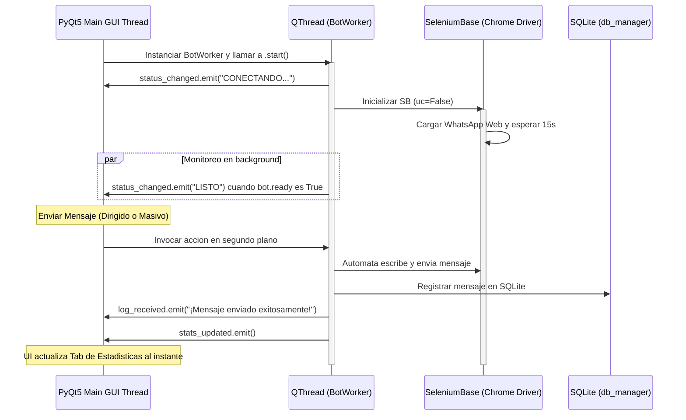

# Arquitectura de la Interfaz Grafica Desktop (PyQt5) y Sincronizacion de Hilos

Este documento detalla la arquitectura de la aplicacion de escritorio **PyQt5**, la cual ha sido disenada para ofrecer una interfaz grafica premium (Dark Mode) y una **ejecucion asincrona y fluida que nunca bloquea ni "congela" la UI** mientras se controlan multiples navegadores SeleniumBase en paralelo.

---

## 🏗️ Patron de Hilos y Senales (PyQt5 Thread-Safe Architecture)

En aplicaciones graficas como PyQt5, **el hilo principal (Main GUI Thread) es el unico autorizado para interactuar con los widgets de pantalla** (QTableWidget, QTextEdit, QComboBox, etc.). Intentar modificar un componente grafico desde un hilo secundario (`threading.Thread`) puede corromper la memoria de la aplicacion, causar cierres inesperados o congelar la interfaz.

Para solucionar esto de manera profesional, implementamos una arquitectura orientada a eventos utilizando **`QThread` y Senales (`pyqtSignal`) de PyQt5**:

### Componentes de Sincronizacion

1. **`BotWorker` (`QThread`)**:
   - Cada bot seleccionado se ejecuta de manera independiente en su propio hilo secundario de Qt (`QThread`).
   - Evita de forma absoluta que las esperas (`time.sleep`) o cargas de red de SeleniumBase detengan el bucle de eventos (`event loop`) de la interfaz grafica.

2. **Senales de Comunicacion Segura (`pyqtSignal`)**:
   - `status_changed(str, str)`: Emite el ID de sesion y el estado del bot (`APAGADO`, `CONECTANDO...`, `LISTO`, `ERROR`). El hilo principal recibe esta senal y actualiza dinamicamente el color y texto de la tabla de control.
   - `log_received(str, str)`: Pipea de forma asincrona todos los logs de los navegadores hacia la consola de terminal integrada en la UI (`QTextEdit`).
   - `stats_updated()`: Emitida inmediatamente despues de registrar un mensaje exitoso en SQLite. Al recibirla, la UI vuelve a consultar la base de datos y actualiza la tabla de estadisticas Many-to-Many **en tiempo real**.

3. **Inyeccion de Callbacks y Hilo-Seguridad**:
   - Modificamos la clase `WhatsappBot` en `bot_sb.py` para aceptar un `log_callback`. El `BotWorker` inyecta un callback que redirige los logs a la senal `log_received` de PyQt5 de manera transparente.
   - Cada bot conserva su `self.lock = threading.Lock()` para serializar interacciones concurrentes y proteger el puerto de control de Selenium.

---

## 🗃️ Persistencia de Datos y CRUD (SQLite)

La aplicacion grafica esta totalmente integrada con la base de datos `base_de_datos/whatsapp_bot.db` a traves de `db_manager.py`. Esto permite:
* **CRUD de Perfiles**: Crear, Editar y Eliminar perfiles fisicos en SQLite directamente desde formularios modales graficos sin salir de la app.
* **CRUD de Grupos**: Registrar grupos oficiales de destino.
* **Asociacion Muchos a Muchos**: Vincular dinamicamente perfiles con grupos y visualizar el total de mensajes enviados e informacion de ultimo mensaje de forma limpia y ordenada.

---

## 🌟 Ventajas del Diseno Grafico Implementado
* **UI Liquida y Reactiva**: La interfaz se puede mover, redimensionar y operar de manera fluida incluso si hay mas de 3 navegadores abriendose al mismo tiempo en segundo plano.
* **Consola de Logs Unificada**: Centraliza el monitoreo de todos los bots en un solo componente de consola oscuro con tipografia monospace verde estilo terminal.
* **Diseño Dark Mode Premium**: Estilizado mediante hojas de estilos QSS personalizadas con bordes redondeados y transiciones sutiles que generan un gran impacto visual.
